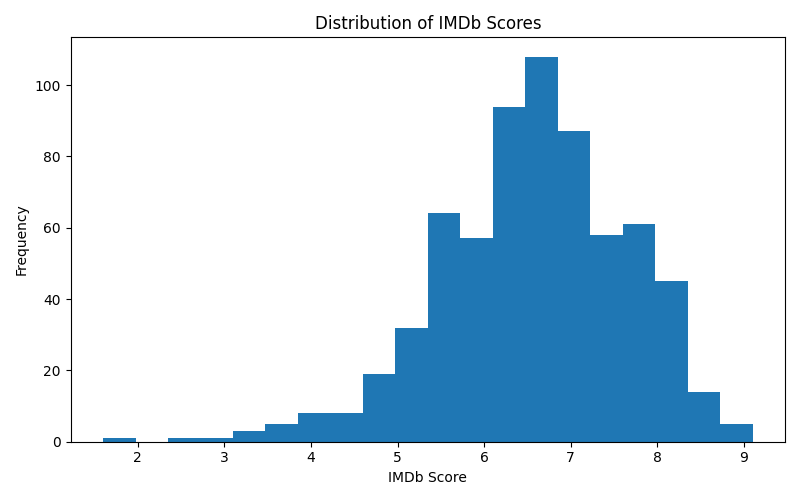
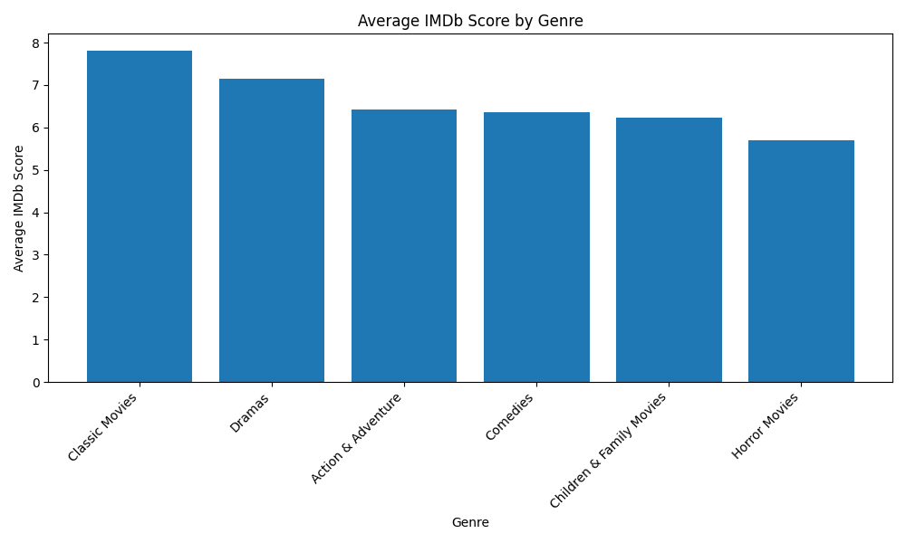
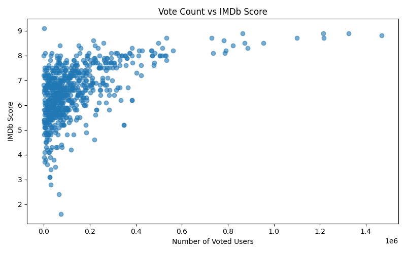
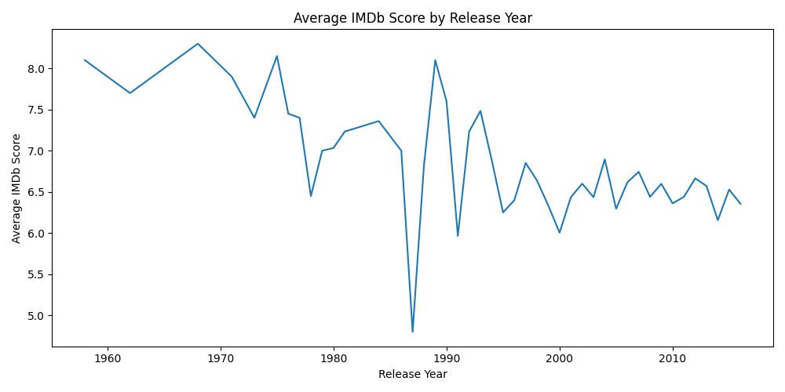
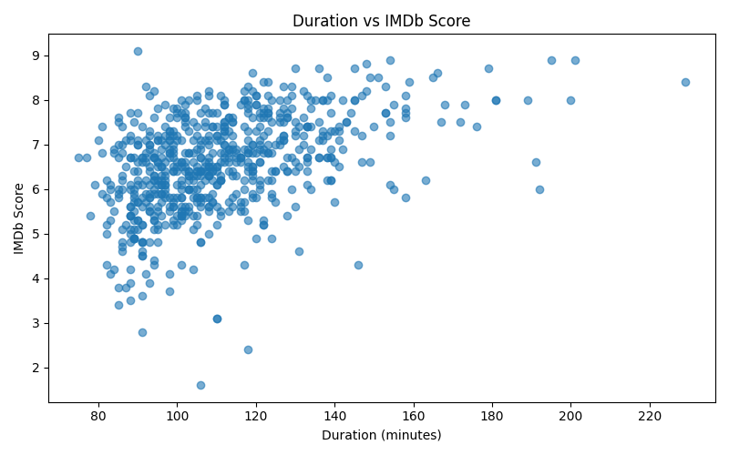
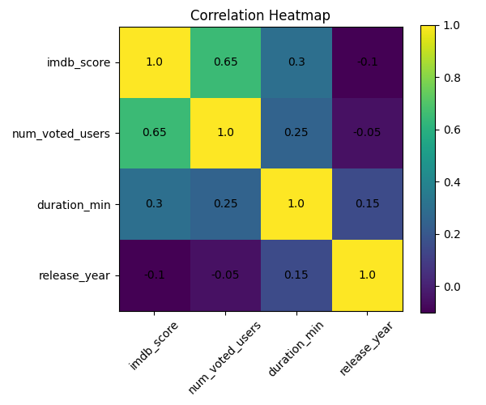

# Movie Rating Analysis

## Overview

This project analyzes movie ratings using Netflix and IMDb datasets.

The goal is to understand which factors affect movie ratings and how different variables are related to each other.

This project focuses on data collection, exploratory data analysis (EDA), and hypothesis testing.

---

## Data Collection

The data used in this project comes from two sources:

* **Netflix dataset**: contains movie information such as title, genre, release year, and duration
* **IMDb dataset**: contains movie ratings and number of votes

These datasets were merged using movie titles to combine movie characteristics with audience feedback.

---

## Data Preparation

Before analysis, the following steps were applied:

* Only movies were selected from the Netflix dataset
* Titles were converted to lowercase for better matching
* Datasets were merged based on title
* Missing values were removed
* Duration values were converted to numeric format
* The first listed genre was selected as the main genre

---

## Variables

The main variables used in the analysis are:

* **imdb_score** → movie rating (target variable)
* **num_voted_users** → audience engagement
* **release_year** → time factor
* **duration_min** → movie length
* **primary_genre** → movie type

---

## Exploratory Data Analysis (EDA)

EDA was used to explore patterns and relationships in the dataset.

---

### IMDb Score Distribution



```python
plt.hist(clean["imdb_score"], bins=20)
plt.xlabel("IMDb Score")
plt.ylabel("Frequency")
plt.title("Distribution of IMDb Scores")
```

This graph shows that most movies have medium to high scores.

---

### Average Score by Genre



```python
plt.bar(genre_plot.index, genre_plot["mean"])
plt.xticks(rotation=45)
plt.title("Average IMDb Score by Genre")
```

This graph shows that ratings differ across genres.

---

### Votes vs Score



```python
plt.scatter(clean["num_voted_users"], clean["imdb_score"])
plt.xlabel("Votes")
plt.ylabel("Score")
```

This graph shows a positive relationship between votes and ratings.

---

### Year vs Score



```python
plt.plot(year_avg["release_year"], year_avg["imdb_score"])
plt.xlabel("Year")
plt.ylabel("Score")
```

This graph shows how ratings change over time.

---

### Duration vs Score



```python
plt.scatter(clean["duration_min"], clean["imdb_score"])
```

This graph shows a weak relationship between duration and rating.

---

### Correlation Heatmap



```python
sns.heatmap(clean[["imdb_score","num_voted_users","duration_min","release_year"]].corr(), annot=True)
```

This graph shows relationships between numerical variables.

---

## Hypothesis Testing

Three statistical tests were applied:

### Hypothesis 1: Votes and Rating

* H0: No relationship between votes and rating
* H1: There is a relationship

Result: There is a significant positive correlation between votes and ratings.

---

### Hypothesis 2: Genre and Rating

* H0: All genres have the same average rating
* H1: At least one genre is different

Result: Genre has a significant effect on ratings.

---

### Hypothesis 3: Old vs New Movies

* H0: No difference between old and new movies
* H1: There is a difference

Result: Older movies have slightly higher ratings in this dataset.

---

## Conclusion

* Movies with more votes tend to have higher ratings
* Genre significantly affects ratings
* Older movies tend to have higher ratings
* Duration has a smaller effect

Overall, both audience behavior and movie characteristics influence movie ratings.

---

## Project Structure

* Python script for analysis
* Cleaned dataset
* Statistical test results
* Visualizations

---

## Author

Alim Ata Balcı
